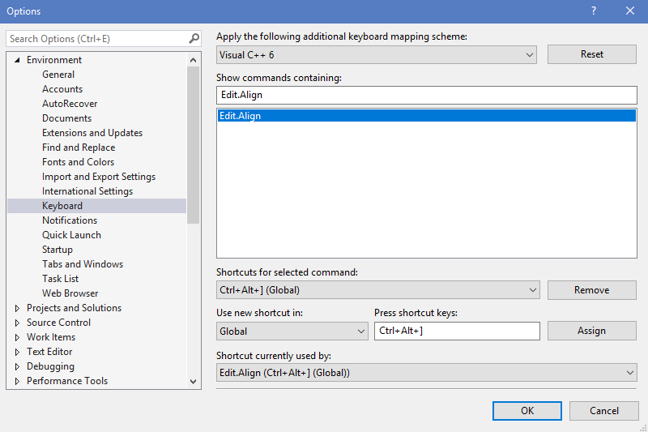
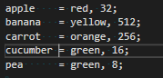
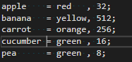
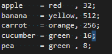
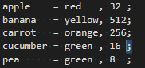
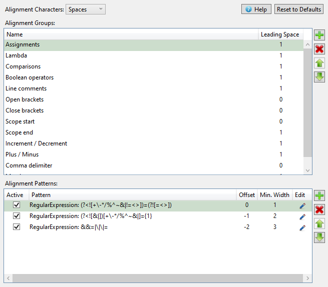

# Rylogic Text Aligner

## Overview

Rylogic Text Aligner is an extension that adds a command to the edit menu for vertically aligning text. Vertical text alignment is a powerful productivity aid when used in combination with column selection. Vertically aligned text also leverages your subconscious ability to spot patterns, making pattern-breaking bugs much easier to spot. Notice how much easier it is to spot the bug in the second of the following two code examples:


## Details

### Usage

The _Align_ command is available under the Edit -> Advanced Menu. For convenience however, I recommend creating a keyboard shortcut. Select _Options_ from the _Tools_ menu, and then _Keyboard_ under the _Environment_ section. Type "Edit.Align" into the search text field, then choose your keyboard shortcut, and click assign. E.g.



The first, and most basic use case, is to align assignments:


To align some text, move the caret onto a line of text within a block and hit your keyboard shortcut. The extension intelligently searches above and below the current caret position, identifies the alignment group nearest the caret and aligns the text. Note that alignment is not limited to just assignments, repeatedly pressing your keyboard shortcut will identify other alignment groups and align to those. For example, create a new text file and copy in the following text:

```
apple = red, 32;
banana = yellow, 512;
carrot = orange, 256;
cucumber = green, 16;
pea = green, 8;
```

Now, move the caret to the position just after the 'r' in 'cucumber' and press your keyboard shortcut twice. The text should be aligned as follows:





You can also tell the extension to align to specific characters by selecting the text to align to before pressing your keyboard shortcut. For example, select a ';' character then align:




Sometimes there is a need to limit the range of lines that aligning is applied to. This can be achieved by selecting multiple lines before hitting align:


Notice that whole lines do not need to be selected.

### Options

The character sequences recognised as 'alignable' are defined in the options. Select _Options_ from the _Tools_ menu, then _Align Options_ under the _Rylogic_ section.



All options are saved to an XML file in your AppData folder:
```%USERPROFILE%\AppData\Roaming\Rylogic\VSExtension\align_patterns.xml```

The _Alignment Characters_ option is used to select between different whitespace styles. The supported schemes are:

- Spaces - space characters are used, aligning to the left-most common column,
- Tabs - tab characters are used, aligning to the left-most common tab boundary based on the user's tab size setting,
- Mixed - both tab and space characters are used, aligning to the left-most common column using tabs were possible,

The top table contains the alignment groups, and the lower table contains the patterns that are all considered equivalent for a given group. In the image above, the group _Comparisons_ consists of the patterns: ```==, !=, <=, >=, >, and <```. Patterns can be simple substrings, wildcard expressions, or regular expressions. To edit a pattern, select the pencil icon to display the pattern editor:


### Unalign

In version 1.9, the _Unalign_ command was added. It uses logic similar to the _Align_ command to select the appropriate alignment group, based on nearby text and the lines above and below the caret position. _Unalign_ removes consecutive whitespace to the left of the matched pattern on each line. For alignment groups with leading space, a single whitespace character is added. Trailing whitespace is also removed for affected lines.

Using the text example from above, unaligning should result in the following sequence. Notice that the priority of alignment groups is reversed, compared to _Align_, so that _Unalign_ is almost the inverse operation:


Similarly, selecting text to unalign on is also possible:


The range that unaligning is applied to can be limited by multi-line selection. As before, whole lines do not need to be selected:


Unlike _Align_, the _Unalign_ command can also be used with selected text where no alignment patterns match. In this case, the _Unalign_ command replaces any consecutive white-space with single white-space characters. The command preserves leading indentation, and is aware of C-style literal strings, including multi-line strings so long as they are spanned by the selection.


Notice that multiple whitespace within the quoted literal string is preserved.

The _Unalign_ command is available under the Edit -> Advanced Menu. Again, for convenience, I recommend creating a keyboard shortcut using the same process as above, except with "Edit.Unalign" in the search text field.

#### Version History

- *v1.9 - 2020-05-27*
  - Unalign feature added.
  - Default leading space for 'Commas' group set to 0. Set it back to 1 if you prefer space to the left of your commas.

- *v1.8 - 2020-03-23*
  - Option to use spaces, tabs, or both for aligning added.
  - Replaced the UI components, used in the options dialog, with an implementation based on WPF. This solved a bug related to RichEdit controls and LoadLibrary in the previous version (thanks Quinten!).
  
- *v1.7 - 2018-07-02*
  - First public release.
