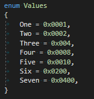
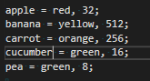

# Rylogic Text Aligner

## Requirements

- Visual Studio 2015+

## Overview

Rylogic Text Aligner is an extension that adds a command to the edit menu for vertically aligning text. More than simply satisfying the obsessive compulsives out there, vertical text alignment is a powerful productivity aid when used in combination with column selection. Vertically aligned text also leverages your subconscious ability to spot patterns, making pattern-breaking bugs much easier to spot. Notice how much easier it is to spot the bug in the second of the following two code examples:




## Details

### Usage

The _Align_ command is available under the Edit -> Advanced Menu. For convenience however, I recommend creating a keyboard shortcut. Select _Options_ from the _Tools_ menu, and then _Keyboard_ under the _Environment_ section. Type "Edit.Align" into the search text field, then choose your keyboard shortcut, and click assign. E.g.


The first, and most basic use case, is to align assignments:


To align some text, move the caret onto a line of text within a block and hit your keyboard shortcut. The extension intelligently searches above and below the current caret position, identifies the alignment group nearest the caret and aligns the text. Note that alignment is not limited to just assignments, repeatedly pressing your keyboard shortcut will identify other alignment groups and align to those. For example, create a new text file and copy in the following text:

```
apple = red, 32;
banana = yellow, 512;
carrot = orange, 256;
cucumber = green, 16;
pea = green, 8;
```

Now, move the caret to the position just after the 'r' in 'cucumber' and press your keyboard shortcut twice. The text should be aligned as follows:




You can also tell the extension to align to specific characters by selecting the text to align to before pressing your keyboard shortcut. For example, select a ';' character then align:


### Options

The character sequences recognised as 'align-able' are defined in the options. Select _Options_ from the _Tools_ menu, then _Align Options_ under the _Rylogic_ section.


These values are saved to an XML file in your AppData folder:
```%USERPROFILE%\AppData\Roaming\Rylogic\VSExtension\align_patterns.xml```

The top table contains the alignment groups, and the lower table contains the patterns that are all considered equivalent for a given group. In the image above, the group _Comparisons_ consists of the patterns: ```==, !=, <=, >=, >, and <```. Patterns can be simple substrings, wildcard expressions, or regular expressions. To edit a pattern, select the pencil icon to display the pattern editor:


